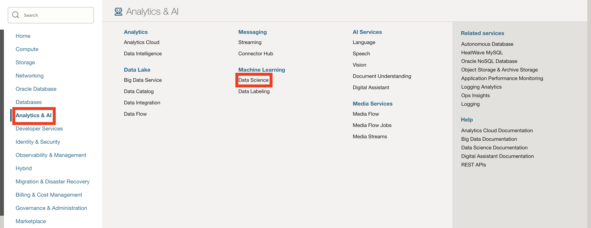
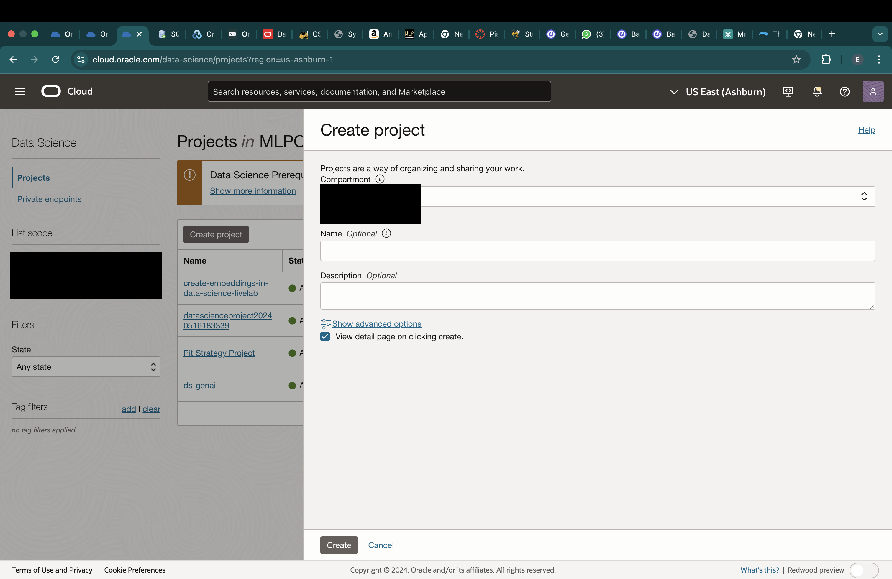
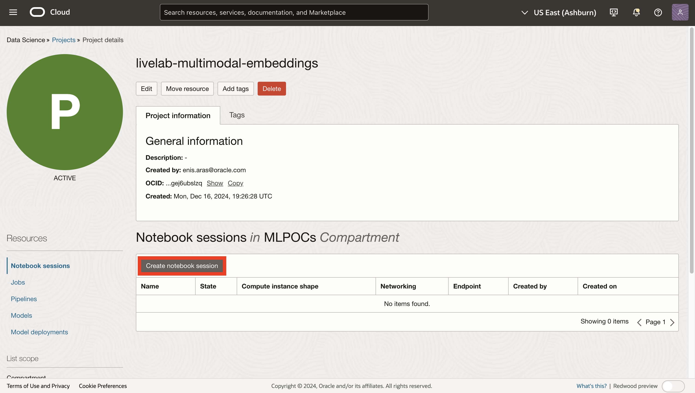
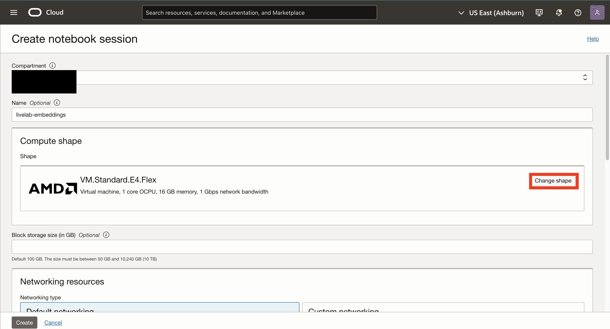
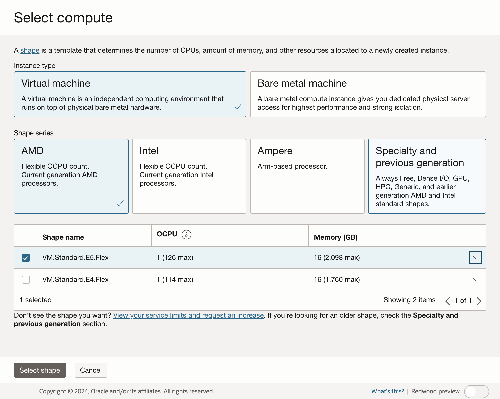
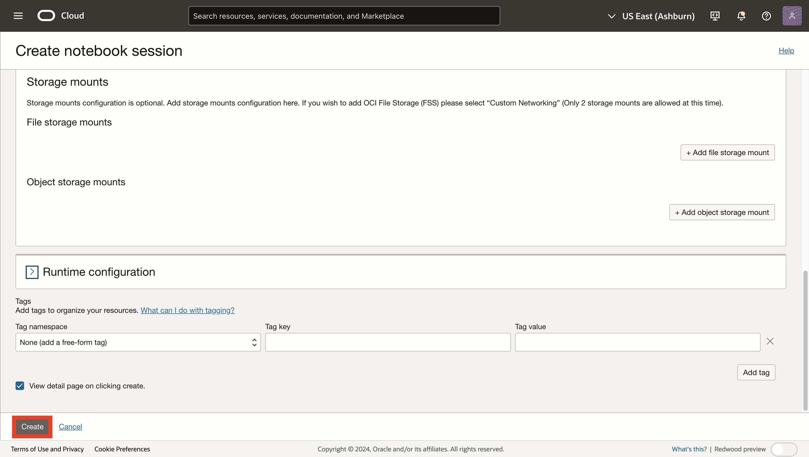

# Lab 2: Deploy Multimodal Embedding Model on OCI Data Science

## Introduction

OCI Data Science is a comprehensive offering for experimenting with machine learning algorithms, testing them and deploying them to production on OCI Compute shapes. In this lab, we will use Data Science BYOC Model Deployments to deploy a multimodal embedding model and experiment with it using the Python SDK.

## Task 1: Create a Data Science Project

1. Open the main "hamburger" menu in the top left corner of the Console. Select "Analytics & AI" and then click "Data Science".    

2. Click Create Project.

3. Give your project a name and specify desired compartment.

## Task 2: Create a Data Science Notebook Session
1. Click Create a Notebook Session.

2. Click Change Shape.

3. Click VM.Standard.E5.Flex to create 1 OCPU and 16 GB RAM virtual machine.

4. Click Create to create your notebook session.

